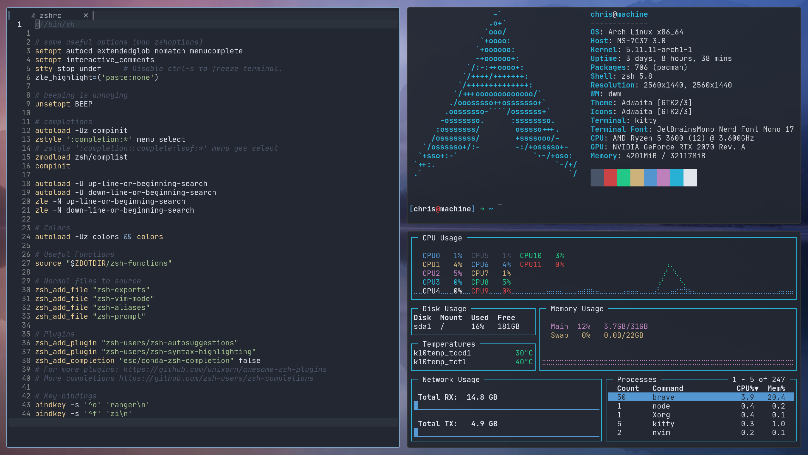

# Machfiles



## Installing

You will need `git` and GNU `stow`

Clone into your `$HOME` directory or `~`

```bash
git clone https://github.com/ChristianChiarulli/Machfiles.git ~
```

Run `stow` to symlink everything or just select what you want

```bash
stow */ # Everything (the '/' ignores the README)
```

```bash
stow zsh # Just my zsh config
```

## Programs

An updated list of all the programs I use can be found in the `programs` directory
